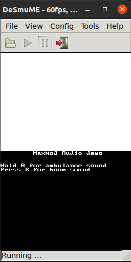
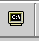

# Software Requirements for Computers Subject in Linux 

# 1. Objectives

The objective of this doc is to explain how to install and verify installation in the host of the **BMDE toolchain** 
components. The BMDE is used in subjects:

* *Computers* (primary focus): The whole Computers subject uses all software described in this documentation.
* *Operating Systems Structure (ESO)* (secondary focus): Only the practical part of this subject needs all software 
  described in this documentation.
* *Fundamentals of Computers (FC)* (tertiary focus): Only debug, build and edit. 


---

# 2. Deployment Strategy and Docker Considerations

Since **Milax** is the de-facto Linux environment used by students, and the system image is managed centrally, the 
recommended approach is to use bare-metal installations, instead of using the Docker based installations already built 
for the BMDE CLI. 

When tools are already deployed directly on an 
operating system under full administrative control (as milax is), Docker does not provide significant added value. 
Therefore, a 
**native package-based installation** is preferred.

Docker may still be offered as an **optional alternative**, knowing Docker itself is installed on the milax image. It is
not necessary to integrate specific Docker images directly into the Milax distribution.

---

# 3. BMDE operations vs software components 

A component can be understood as an independent piece of software. One or more components are used together for each 
operation of the BMDE. 

This guide will explain how to:
* Install each component, either the explanation of each step and the proposed commands to do it.
* Test the installation of each needed component.
* Test that each operation is working as expected.

The needed files for everything will be in the provided file host_install.bz2
All proposed commands assume that `CWD=/path/to/host_install`
---

# Operations
## Build Operation
Components:
* make
* devkitARM r46:
  * arm-none-eabi-gcc
  * arm-none-eabi-as
  * arm-none-eabi-ld
  * ndstool (not needed for FC subject): 
* libNDS (not needed for FC subject): 
* devkitPro NDS project examples (optional)

### Component installation
#### make
###### Explanation
Install `make` using your package manager.

The installed binary is expected to be automatically included in your 
`$PATH` by the package manager and because of that available directly through shell commands.

###### Proposed command
```shell
apt-get update && apt-get install -y --no-install-recommends make 
```

###### Test component
```shell
make --help
```

#### devkitARM 
##### Explanation
Create 3 new **permanent** environment variables, which are used in the Makefiles:
* `DEVKITPRO` with value `/path/to/installation/of/devkitPro/`.
* `DEVKITARM` with value `/path/to/installation/of/devkitARM/`.
* `DESMUME` with any value (it just needs to be defined so that it passes the checks of the `Makefile`s).

Modify **permanently** the PATH variable, **prepending** (writing at the beginning) the path `$DEVKITARM/bin` to the 
variable. Including the directories in the `$PATH` make the files in the included directories directly available through 
shell commands. The prepending is 
done to give more priority to our binaries than the system binaries. This priority can be implemented differently 
 if
no priority is needed or this priority is implemented in any other way.

Create the directories `$DEVKITARM` and `$DEVKITPRO`.

Download devkitARM from 
[here](https://wii.leseratte10.de/devkitPro/devkitARM/r46%20%282017%29/devkitARM_r46-x86_64-linux.tar.bz2).

Decompress it in the folder `$DEVKITARM`.

Copy examples into `$DEVKITPRO`.

Optionally, clean installation outputs.

###### Proposed command
```shell
echo DEVKITPRO=/bmde/devkitPro >> $HOME/.bashrc 
echo DEVKITARM=$DEVKITPRO/devkitARM >> $HOME/.bashrc 
echo DESMUME=/ >> $HOME/.bashrc 
echo PATH=$DEVKITARM/bin:$PATH >> $HOME/.bashrc 

mkdir -p $DEVKITPRO $DEVKITARM

apt-get update && apt-get install -y --no-install-recommends \
    wget \
    bzip2 \
 && wget --no-check-certificate "https://wii.leseratte10.de/devkitPro/devkitARM/r46%20%282017%29/devkitARM_r46-x86_64-linux.tar.bz2" -O /tmp/devkitARM.tar.bz2 \
 && tar -xf /tmp/devkitARM.tar.bz2 -C $DEVKITPRO \
 && rm /tmp/devkitARM.tar.bz2

cp -r examples $DEVKITPRO

apt-get purge -y \
    wget \
    bzip2 \
    && apt-get autoremove -y \
    && rm -rf /var/lib/apt/lists/*
```

###### Test component
```shell
make --help && \
arm-none-eabi-gcc --help && \
arm-none-eabi-as --help && \
arm-none-eabi-ld --help && \
ndstool --help
```

#### libnds
##### Explanation
Download and decompress the file `libnds.tar.bz2` into `$DEVKITPRO`. The file `libnds.tar.bz2` has been obtained
directly 
from the original BMDE folder implementation, so in case of update of the original BMDE, it will be needed to update 
the provided file. 

This component is only used in the compilation of projects, so its testing involves the building of a NDS project 
(operation test). That is why the test will be skipped for this component and the 
corresponding folder `hello-world-nds` is provided. 

###### Proposed command
```shell
wget https://raw.githubusercontent.com/URV-teacher/devkitarm-nds-docker/master/data/libnds.tar.bz2 -O /tmp/libnds.tar.bz2
tar -xjf /tmp/libnds.tar.bz2 -C $DEVKITPRO
rm /tmp/libnds.tar.bz2
```

### Test operation
```shell
git clone https://github.com/URV-teacher/hello-world-nds.git
cd hello-world-nds
make
[ -f hello-world-nds.nds ]
# desmume hello-world-nds.nds  # It can be further validated if we have DeSmuME installed.
```

It may be possible that you need to modify a minor thing in the internal file `ds_rules`, that provides building rules 
for NDS projects. 

Optionally, we can also test the operation with the NDS devkitPro project examples:
```shell
wget https://raw.githubusercontent.com/URV-teacher/devkitarm-nds-docker/master/data/examples.tar.bz2 -O /tmp/examples.tar.bz2
tar -xjf /tmp/examples.tar.bz2 -C $DEVKITPRO
rm /tmp/examples.tar.bz2

cd $DEVKITPRO/examples
for i in *; do
  if [ -d "$i" ]; then
      comp_msg=$(cd "$i" && make clean && make 2>&1)
      echo "$comp_msg"
  fi
done
```

---


### Run Operation
Components:
* DeSmuME 0.9.11
* `$DESMUME/DeSmuME.exe` wrapper (optional, to be compatible with `Makefile`s)
* `make`, for `make run` target (`make` already explained in build section)


#### Component installation
##### desmume
###### Explanation
Install `desmume` using your package manager. The installed binary is expected to be automatically included in your 
`$PATH` by the package manager and because of that available directly through shell commands.

Create (or modify) 1 **permanent** environment variables. This is used in the `run` target of the `Makefile`s:
* `DESMUME` with value `/path/to/installation/of/desmume/`. 

###### Proposed command
```shell
apt-get update && apt-get install -y --no-install-recommends desmume 

echo DESMUME=/usr/games >> $HOME/.bashrc 
```

###### Test component
To test the component we will use the NDS example with sound:
```shell
cd examples/nds/audio/maxmod/basic_sound  
# candyNDS_full is already built, but if not you can build it with make, testing also the build operation
desmume basic_sound.nds  
```
You should see something similar to this:



In addition to being able to run it, you should hear sound to validate the sound feature of DeSmuME.


##### `$DESMUME/DeSmuME.exe` wrapper
###### Explanation
Optionally, to make the installation of DeSmuME compatible with the `run` target of `Makefile`s, we need to make 
available the 
file `$DESMUME/DeSmuME.exe`, because it is explicitly referenced by the `Makefile`s.

To do so, we can create a wrapper that forwards the call from `$DESMUME/DeSmuME.exe` into `desmume` command. We could 
implement this in another way, such a shell alias. 

###### Proposed command
```shell
echo "#!/bin/bash
desmume $@" >> $DESMUME/DeSmuME.exe
chmod +x $DESMUME/DeSmuME.exe
```

###### Test component
```shell
$DESMUME/DeSmuME.exe
```

#### Test operation
```shell
cd hello-world-nds
make clean
make
make run
```

You should see the DeSmuME window appearing with the hello-world message.

This test is accumulative with the build operation, because it implies it, so, if a functional `.nds` binary can be 
generated from source code and executed using `desmume`, the environment can be considered operational. 

---


### Debug Operation
Components:
* DeSmuME 0.9.11 with argument `--gdbport=$PORT` to listen to TCP port `$PORT`
* GDB debugger. Can be one of the following (WIP):
  * `arm-none-eabi-gdb`, available in `$DEVKITARM/bin/arm-none-eabi-gdb` (already explained in build operation section)
  * `gdb-multiarch`, available through package manager
  * `insight`, installed from source code
* `make`, for `make debug` target (`make` already explained in build operation section)


#### Component installation
##### DeSmuME 0.9.11 with argument `--gdbport=$PORT` to listen to TCP port `$PORT`
###### Explanation
Using the `desmume` command obtained in the previous section Run Operation with argument `--gdbport=$PORT`. We recommend 
`PORT` to be higher or equal to 1024 to avoid problems, since lower ports are privileged and give problems. 

Unluckily the `Makefile`s has the hardcoded argument `--gdbport=1000` in the `make debug` option, so it may be not 
possible to use this target.

###### Test component
To test the component we will use the NDS example with sound:
```shell
desmume --gdbport=1024
netstat -tlp | grep 1024
```

##### `arm-none-eabi-gdb`
###### Explanation
GDB binary bundled with devkitARM. Proposed installation commands are the same as Build Operation.

###### Proposed command
```shell
echo "#!/bin/bash
desmume $@" >> $DESMUME/DeSmuME.exe
chmod +x $DESMUME/DeSmuME.exe
```

###### Test component
```shell
arm-none-eabi-gdb --version
```

##### `gdb-multiarch`
###### Explanation
Standard multi-architecture GDB provided via package manager. 

###### Proposed command
```shell
apt-get update && apt-get install -y --no-install-recommends gdb-multiarch 
```

###### Test component
```shell
gdb-multiarch --version
```


##### `insight` (from source)
###### Explanation
Insight is the original debugger (and simulator for FC) in the BMDE debugger. 

###### Proposed command
To build `insight`:
```shell
set -euo pipefail

export DEBIAN_FRONTEND=noninteractive

SRC_DIR="insight-src"
INSIGHT_REPO="git://sourceware.org/git/insight.git"

apt-get update
apt-get install -y \
    autoconf \
    automake \
    autogen \
    tk-dev \
    tcl-dev \
    libgmp-dev \
    libmpfr-dev \
    texinfo \
    bison \
    flex \
    git \
    build-essential

mkdir -p "${SRC_DIR}"
cd "${SRC_DIR}"

if [ ! -d "${SRC_DIR}/insight" ]; then
    git clone --depth 1 --recursive "${INSIGHT_REPO}"
fi

cd insight

autoconf
autoupdate

./configure \
    --prefix=/usr/local \
    --libdir=/usr/lib64 \
    --disable-binutils \
    --disable-elfcpp \
    --disable-gold \
    --disable-gprof \
    --disable-ld \
    --disable-rpath \
    --disable-zlib \
    --enable-sim \
    --with-gdb-datadir=/usr/share/insight \
    --with-jit-reader-dir=/usr/lib64/insight \
    --with-separate-debug-dir='/usr/lib/debug' \
    --with-expat \
    --without-libunwind \
    --without-isl \
    --without-python

make -j"$(nproc)"
make install
```

Runtime dependencies:
```shell
apt-get update && apt-get install -y \
    itcl3 \
    itk3 \
    iwidgets4 \
    libgmp10 \
    libmpfr6 \
    libexpat1 \
    && rm -rf /var/lib/apt/lists/*
```


###### Test component
```shell
insight --version
```


#### Test operation through `make debug`
Test the debug operation using `Makefile` and the example program Mastermind. The binary is already built in Mastermind 
folder, but if you build it
make sure 
that the flags `-gdwarf-3` and `-O0` are in the `CFLAGS` (arguments passed to `gcc`) of the `Makefile`. This applies to 
all programs that you want to debug:
```shell
wget https://raw.githubusercontent.com/URV-teacher/insight-docker/master/data/Mastermind.tar.bz2 -O /tmp/Mastermind.tar.bz2
tar -xjf /tmp/Mastermind.tar.bz2
rm /tmp/Mastermind.tar.bz2

cd Mastermind
make clean
make  

make debug  # Implicitly uses 
```

After running the commands you should see both the Insight window and the DeSmuME window similarly to this:

To start the debug session you need to do the following
1. Click in the terminal icon of Insight 
2. In the Insight GDB console, execute:
    ```gdb
    target remote :1000
    break main
    continue
    ```
3. You should see Insight stopping at the first line of the line. 
4. You can change the source code mode to see different
   versions of the source code (ARM, mixed...) like this:
5. Then, introduce the command `break MM_check` to set a breakpoint into the ARM function `MM_check`.
6. Then, you should introduce the command `continue` in the GDB console. After that, the debugger window should be blocked 
   and DeSmuME already running and waiting for input.
7. Use the keyboard to press the buttons of the emulated NDS and introduce the required input for the Mastermind 
   program. In this case, you need to press they key Z three times.
8. After that, it will be the opposite: DeSmuME window is blocked and the debugger is answering again.
9. Introduce the command `continue`. After that, the debugger window should be blocked 
   and DeSmuME already running and waiting for input.
10. Introduce the required input with the buttons into MasterMind program.
11. DeSmuME window is blocked and the debugger is answering again. 
12. Now press again source code to see the ARM source code.
13. Now press other buttons of the GUI to evaluate its functionality.  


#### Test operation manually
You can also test the debug operation "manually" calling directly the commands to do a debug session. Instead of 
Insight, you may use any other GDB command, but we will explain the test using inside because it is the most 
featured debugger:
```shell
wget https://raw.githubusercontent.com/URV-teacher/insight-docker/master/data/Mastermind.tar.bz2 -O /tmp/Mastermind.tar.bz2
tar -xjf /tmp/Mastermind.tar.bz2
rm /tmp/Mastermind.tar.bz2

cd Mastermind
make clean
make

# Being in the same working directory as the project root that we are debugging is important to let insight see the 
# source code.
desmume --gdbport=1024 Mastermind.nds &
insight Mastermind.elf  # Also gdb-multiarch or arm-none-eabi-gdb should work
```

What you should see afterward is the same as in the previous section.

---


### Edit Operation
Components:
* Visual Studio Code
* arm-nds-vscode-extension

The goal is to provide an IDE to edit code and have syntax highlight for:
* ARM v5 assembly (Nintendo DS)
* C language

<!--
or 
* Programmer's Notepad (WIP)


#### Component installation
##### Programmer's notepad
###### Explanation
Programmer's notepad is the original code editor used in the original BMDE. The main reason for this is the support for 
ARM v5 syntax highlight (`.s` files used in the subject).

It may be not possible to install it in Linux? WIP

###### Proposed command
```shell
apt-get update && apt-get install -y --no-install-recommends desmume 

echo DESMUME=/usr/games >> $HOME/.bashrc 
```

###### Test component
```shell
pn
```
-->

##### Visual Studio Code
###### Explanation
Visual Studio Code is a modern IDE.

We will install it using the prebuilt binaries available in their website.

###### Proposed command
```shell
VSCODE_DIR=/bmde/vscode
echo PATH=$VSCODE_DIR/bin:$PATH >> $HOME/.bashrc 

mkdir -p $VSCODE_DIR

apt-get update && apt-get install -y --no-install-recommends \
    wget \
    ca-certificates \
 && wget --no-check-certificate -L "https://code.visualstudio.com/sha/download?build=stable&os=linux-x64" -O /tmp/vscode.tar.gz \
 && tar -xzvf /tmp/vscode.tar.gz -C $VSCODE_DIR \
 && rm /tmp/vscode.tar.gz

apt-get purge -y \
    wget \
    ca-certificates \
    && apt-get autoremove -y \
    && rm -rf /var/lib/apt/lists/*
```

###### Test component
```shell
code
```

Should start the program.

##### NDS ARM Assembly Syntax Highlight extension
###### Explanation
Extension for VSCode to enable syntax highlight for ARM v5. Available in the 
[marketplace](https://marketplace.visualstudio.com/items?itemName=aleixmt.nds-arm-assembly-syntax-highlight).

###### Proposed command
Once we have the command `vscode` available we can do the following to install the extension: 
```shell
LATEST_VERSION=$(curl -s https://api.github.com/repos/URV-teacher/arm-syntax-vscode-extension/releases/latest | grep "tag_name" | cut -d '"' -f 4)
LATEST_VERSION=${VERSION:1}
wget -O arm-syntax-vscode-extension.vsix \
  https://github.com/URV-teacher/arm-syntax-vscode-extension/releases/download/v${LATEST_VERSION}/arm-syntax-vscode-extension-${LATEST_VERSION}.vsix  # Download latest release
code --install-extension arm-syntax-vscode-extension.vsix  # Install extension
```

#### Test operation
```shell
```shell
code Mastermind/source/mm_check.s
```

Then, open file `Mastermind/source/mm_check.s` in the IDE.

You should see the syntax highlight for ARM in this file of the Mastermind project.


---

### VCS Operation
Components:
* git
* ssh-client
* forticlient or openfortivpn

#### Component installation
##### git
###### Explanation
Install `git` and `gitk` using your package manager. Version control for course software projects.

###### Proposed command
```shell
apt-get update && apt-get install -y --no-install-recommends git gitk
```

###### Test component
```shell
git --version
```

##### ssh-client
###### Explanation
SSH authentication is required for accessing the repositories.

###### Proposed command
```shell
apt-get update && apt-get install -y --no-install-recommends openssh-client
```

###### Test component
```shell
ssh -V
```

##### forticlient or openfortivpn
###### Explanation
VPN access to the university network. Course Git repositories are only accessible from within the university network. VPN access is therefore required for off-campus work.

###### Proposed command
For `openfortivpn`:
```shell
apt-get update && apt-get install -y --no-install-recommends openfortivpn
```

###### Test component
```shell
openfortivpn --version
```

#### Test operation
When connected to the VPN (or on campus), the following command should work:

```bash
git clone USER_ID@git.deim.urv.cat:comp_25 .
```

This requires:
* The Git server to be active
* The repository `comp_25` to exist
* Proper access permissions

The Git server is maintained by the course supervisor:
**Santiago Romaní** ([santiago.romani@urv.cat](mailto:santiago.romani@urv.cat))

---

### Optional Operations
Components:
* grit

#### Component installation
##### grit
###### Explanation
Grit is a tool for converting images into GBA/NDS compatible formats. It is useful for graphics development on the NDS.

###### Proposed command
Download the latest release from the [GitHub repository](https://github.com/devkitPro/grit/releases) or install via package manager if available.

Assuming a manual installation from a tarball:
```shell
GRIT_DIR=/bmde/grit
mkdir -p $GRIT_DIR
wget -O /tmp/grit.tar.bz2 "URL_TO_GRIT_TARBALL"
tar -xf /tmp/grit.tar.bz2 -C $GRIT_DIR
rm /tmp/grit.tar.bz2
echo PATH=$GRIT_DIR:$PATH >> $HOME/.bashrc
```

###### Test component
```shell
grit --help
```

#### Test operation
To test `grit`, you can try converting a simple image:
```shell
grit myimage.png -gB8 -gTFF00FF -o myimage
```
This should generate `myimage.s` and `myimage.h` files.
